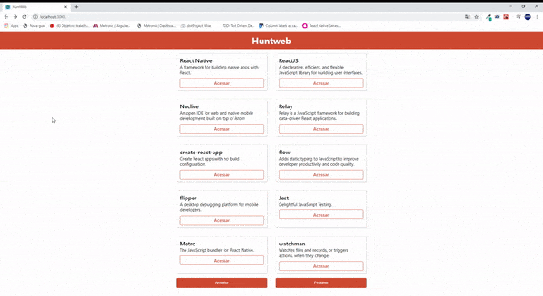

## About this project

This project was created based on the "Huntweb" project while learning to react on Rocketseat.com.br.
This was excellent for improving my React skills with React.

With this project, I learned how to navigate routes with or without paramaters, access a public API provided by Rocketseat, create components, learn about global CSS
and events on parent and child components. This is totally responsive too 😎

## Available Scripts

In the project directory, you can run:

### `npm start`

Runs the app in the development mode. 

The page will reload if you make edits. 
You will also see any lint errors in the console.

### `npm test`

Launches the test runner in the interactive watch mode. 

### `npm run build`

Builds the app for production to the `build` folder. 
It correctly bundles React in production mode and optimizes the build for the best performance.

The build is minified and the filenames include the hashes. 
Your app is ready to be deployed!

## Demo

